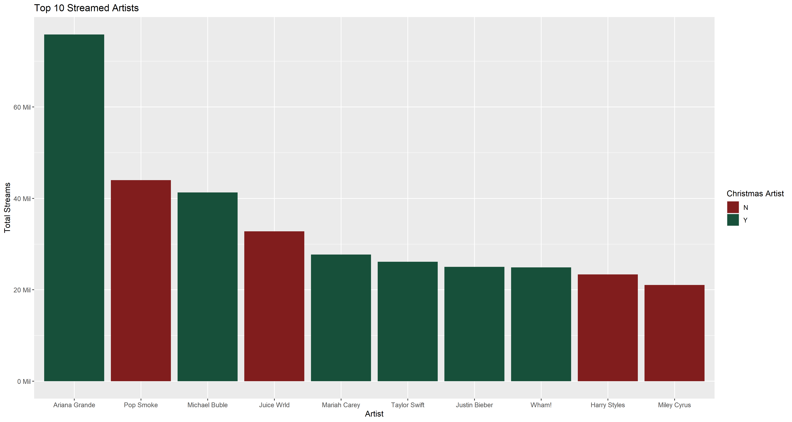
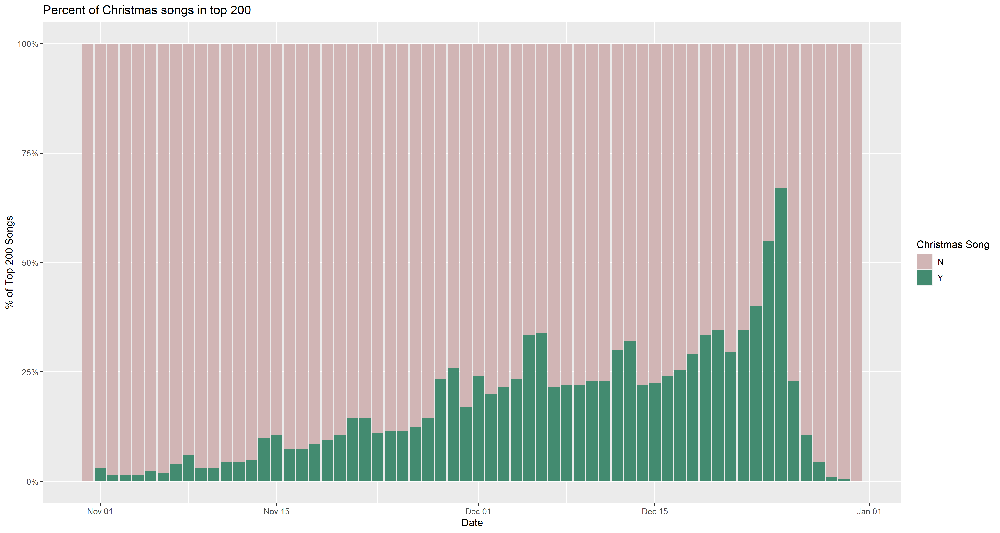

## Project Purpose

This was the first data set from Kaggle, TidyTuesday, Workout Wednesday, etc. that I thought would be interesting for a project!  Spotify, Christmas, Tableau, what more could we ask from a weekly challenge?

For quick [context](http://www.workout-wednesday.com/2020w52/), this data set provides the top 200 streamed songs from Halloween to the New Year.  I decided to focus just on 2019, instead of the two years provided.

I decided to assign a value of ChristmasArtist if the Singer had ANY top 200 songs that were Christmas related.  So although a majority of Ariana Grande and Taylor Swift streams are non-Christmas related, they still helped contribute to the Christmas joy and spirit with a couple of holiday singles.

Looking at the top 10 streamed artists, 6 of them have a Christmas song!  Mariah Carey, Wham!, and Michael Buble are majority Christmas artists, whereas Ariana Grande, Taylor Swift, and Justin Bieber are majority non-Christmas.  Still, quite an even spread between regular pop and holiday music.

Now how many of the 200 songs are Christmas?

Slowly but surely, the percentage of Christmas songs in the top 200 increases until Christmas, with a sharp decline immediately post-Christmas.  Getting to as high as over 75% of all top 200 songs being a Christmas tune is quite impressive!  There are also noticeable two-day jumps, which should fall on the weekends.  Apparently weekends are more likely to roast some chestnuts.

Analysing a different way, what is the HIGHEST rank of a Christmas song every day?  Above, you can see that it follows a similar trend to the previously discussed percentage plot.  The "jump" to Number 1 is a bit quicker than the percentage increase, and the trend holds that a Christmas song is number 1 from before December 1st to after Christmas.

Now, the most popular Christmas song today is Mariah Carey's _All I Want For Christmas is You_.  How exactly does this holiday song titan hold up, rankings-wise?

No, this plot isn't a mistake.  Mariah Carey's biggest Christmas hit keep the top Christmas spot for the ENTIRE 60 day span, up until right after Christmas.  Looking back and forth between the plots shows just how popular _All I Want For Christmas is You_ really is.

##Additional Conclusions

Aside from the Mariah anomaly, there are a good number of Christmas songs yet to be explored.  Using other data, it might be possible to determine if there are any artists who NEVER had a top 200 hit other than a Christmas song.  A lot of fun, and about 12 days until this project is stored away until next Halloween ☺

